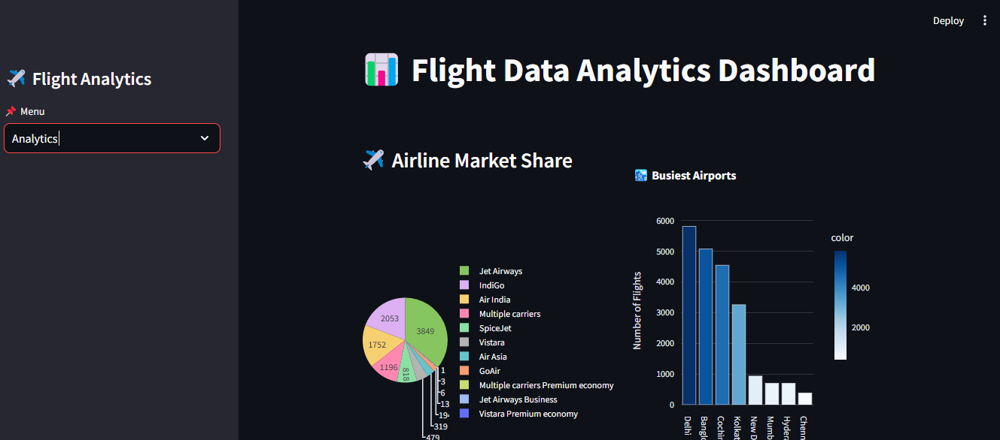

# Flight Analytics Dashboard

## Overview
The **Flight Analytics Dashboard** is a powerful and intuitive tool designed to provide real-time insights into flight data. Built using **SQL, Python, and Streamlit**, this dashboard helps users explore flight trends, analyze airline market shares, and visualize key statistics with interactive charts.

## Features
- **Search for Flights:** Users can search for flights between different cities and analyze flight data.
- **Check Flights:** Get details about available flights based on user input.
- **Analytics Section:** Explore key insights such as airline market share, busiest airports, and price trends.
- **Interactive Charts:** Data is presented in a visually appealing manner using charts and graphs.

## Screenshots
### 1. About the Project

This section provides an introduction to the project, explaining its purpose and key features.

### 2. Search for Flights

A user-friendly interface allows travelers to select source and destination airports to search for available flights.

### 3. Flight Data Analytics

A detailed dashboard showcasing airline market share, busiest airports, and other important flight-related insights.

## Technologies Used
- **Python**
- **Streamlit**
- **SQL**
- **Pandas**
- **Matplotlib / Seaborn** (for visualization)
